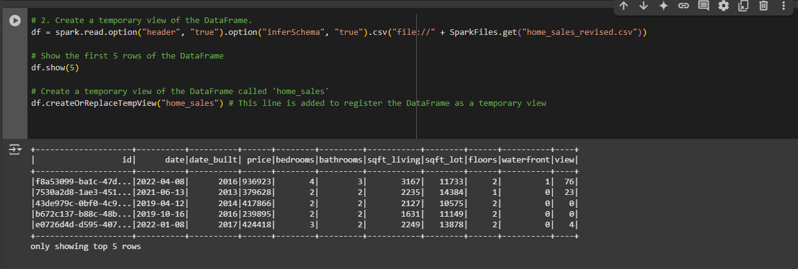
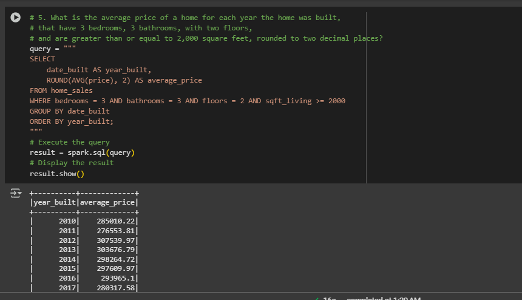
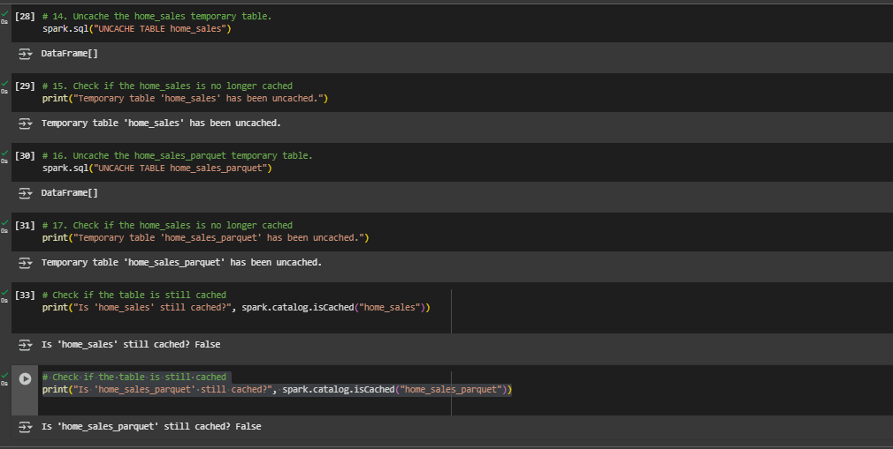

# Home_Sales

## **Table of Contents**
- [Home\_Sales](#home_sales)
  - [**Table of Contents**](#table-of-contents)
  - [**Project Overview**](#project-overview)
    - [**Objective**](#objective)
    - [**Key Findings**](#key-findings)
  - [**Summary**](#summary)
  - [**Technologies / Dependencies Needed and Used**](#technologies--dependencies-needed-and-used)
  - [**How to Run the Application**](#how-to-run-the-application)
    - [**Option 1: Run Locally**](#option-1-run-locally)
    - [**Option 2: Run in Google Colab**](#option-2-run-in-google-colab)
  - [**Sample Visualizations**](#sample-visualizations)
  - [**Data Source**](#data-source)
  - [**Sources**](#sources)
  - [**License**](#license)
  - [**Project By**](#project-by)
  - [**Contact**](#contact)

## **Project Overview**
### **Objective**
Analyze home sales data using PySpark to derive key insights and trends, including:
- **Average home prices over time**
- **Impact of home features (bedrooms, bathrooms, square footage) on pricing**
- **Effects of "view" ratings on home value**
- **Market trends for real estate investors**

### **Key Findings**
........................

## **Summary**
.....................

## **Technologies / Dependencies Needed and Used**
- **findspark**: Enables the use of PySpark in Jupyter Notebooks or standalone scripts by locating the Spark installation.
- **PySpark**: The Python API for Apache Spark, used for big data processing, SQL queries, and machine learning pipelines.
- **time**: A built-in Python module used to measure execution time, useful for performance analysis of queries and computations.
- **Google Colab**: A cloud-based Jupyter Notebook environment that allows users to write and execute Python code in the browser, with free access to GPUs and a preconfigured runtime for data analysis and machine learning.

## **How to Run the Application**
### **Option 1: Run Locally**
1. **Install Dependencies**: See [Technologies / Dependencies Needed and Used](#technologies--dependencies-needed-and-used) for additional information.
2. Clone this repository and run `Home_Sales.ipynb` in Jupyter Notebook.

### **Option 2: Run in Google Colab**
1. Click the button below to open the notebook in Google Colab:  

2. Run all cells from **top to bottom**.

## **Sample Visualizations**
- 📊 **Initial Home Sales DataFrame Preview**
  

- 🔍 **Query 1: Average Home Price per Year**
  

- 🏡 **Query 2: Home Prices by Bedroom & Bathroom Count**
  

- 🌅 **Query 3: Effect of View Ratings on Home Prices**
  

- 🛠️ **Uncaching Temporary Tables in PySpark**
  

## **Data Source**
This dataset was provided as part of the **edX Data Science Boot Camp** curriculum and is intended for **educational purposes only**. It is not publicly available.

## **Sources**
* Office hours / instructional time / T.A.'s
* [pyspark](https://spark.apache.org/docs/latest/api/python/reference/pyspark.sql/index.html)
* [findspark](https://pypi.org/project/findspark/)
* [time](https://docs.python.org/3/library/time.html)
* [Google Colab](https://colab.research.google.com/)
* Xpert Learning Assist
* Tutor sessions (Carlos Gattorno)
* Google
* ChatGPT

## **License**
This project is licensed under the [GNU GENERAL PUBLIC LICENSE Version 3, 29 June 2007](./LICENSE) - see the LICENSE file for details here.

## **Project By**
**Matthew Matti**

## **Contact**
For any questions or feedback, feel free to reach out to me at [mattimatt@hotmail.com](mailto:mattimatt@hotmail.com).

